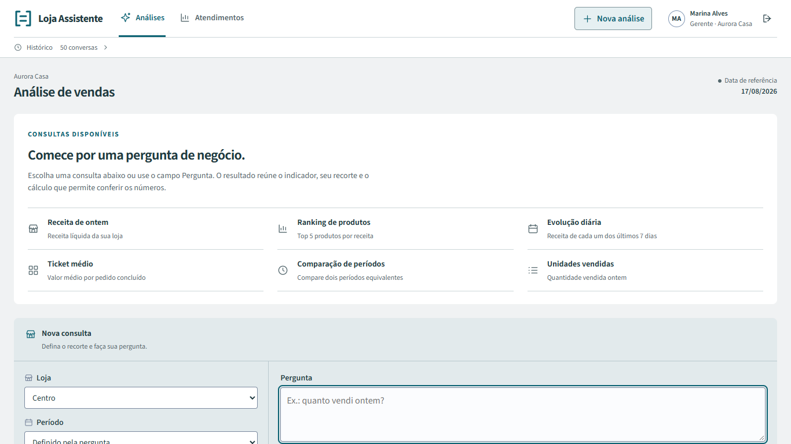
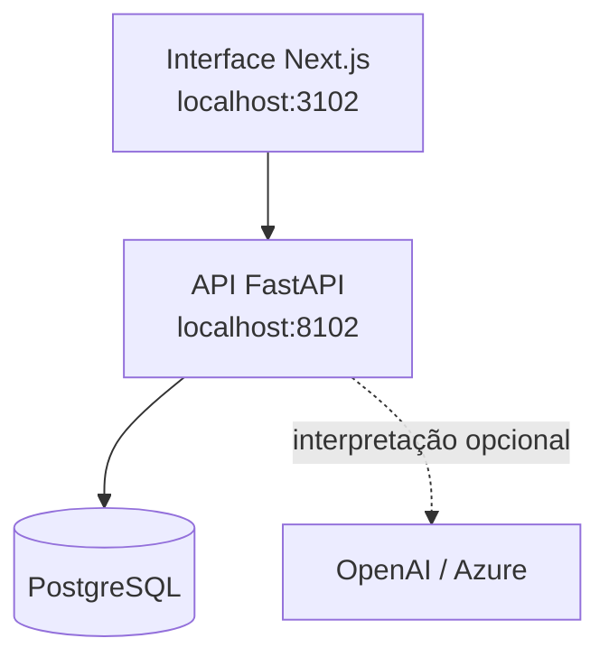

# Loja Assistente

Assistente de análise de vendas para perguntar em português e conferir as lojas, o período e a conta usados na resposta. Desenvolvi interpretação, autorização, consultas e interface sobre vendas fictícias; o modo Demo funciona sem chamadas a um modelo.

<!-- Navegação do README -->
<p>
  <a href="#demonstração"></a>
  <a href="#arquitetura"></a>
  <a href="#executar-localmente"></a>
  <a href="#verificação-e-evidências"></a>
  <a href="https://www.linkedin.com/in/arthur-joanes-6a2967373/"></a>
</p>

## Visão geral

A pergunta vira um plano limitado; o servidor confere as permissões e calcula. **“Quanto vendi ontem somente em dinheiro?”** pede esclarecimento porque forma de pagamento não existe no contrato. Uma soma correta não basta se responder à pergunta errada.

| Responsabilidade       | Implementação                                                               |
| ---------------------- | --------------------------------------------------------------------------- |
| Interpretar a pergunta | Parser determinístico no modo Demo; provedor opcional no modo LLM           |
| Autorizar o recorte    | Organização, usuário e lojas conferidos no servidor, inclusive no histórico |
| Calcular               | Consultas predefinidas, centavos/Decimal e cobertura de loja/dia            |
| Conferir               | Texto, gráfico, tabela e cálculo consultável usam o mesmo resultado         |

Fontes: [interpretação](backend/src/loja_assistente/assistant/interpretation.py), [autorização](backend/src/loja_assistente/auth/service.py), [consultas](backend/src/loja_assistente/analytics/queries.py) e [apresentação](backend/src/loja_assistente/assistant/presentation.py), conferidas em **22/09/2026**.

<a id="na-prática"></a>

## Demonstração



_Página principal já versionada. Os [recortes por foco](docs/image-captures.md) conservam a data, versão, dados e hashes das capturas de 22/09/2026._

<a id="uma-conta-pequena-e-um-caso-de-consulta"></a>

Na fixture de testes `manual-v1`, **“Quanto vendi ontem?”** usa a referência de 17/08/2026 e consulta Centro A em 16/08:

| Pedido concluído | Conta                                       |   Receita | Unidades |
| ---------------- | ------------------------------------------- | --------: | -------: |
| `oa3`            | 2 garrafas × R$ 6 − R$ 2 + 5 ecobags × R$ 2 |     R$ 20 |        7 |
| `oa4`            | 1 caneca × R$ 10                            |     R$ 10 |        1 |
| Total            | 2 pedidos distintos                         | **R$ 30** |    **8** |

Ticket médio: **R$ 30 / 2 = R$ 15**. Pedido cancelado e vendas de outra organização ficam fora. Fontes: [fixture independente](backend/tests/manual_fixture.py), [esperados](evals/cases/manual-v1.json) e [testes analíticos](backend/tests/test_analytics.py), conferidos em **22/09/2026**. A massa `synthetic-v1` da interface é outra base: seus totais não devem ser comparados com esta conta manual.

<a id="conferir-uma-análise"></a>

Na interface, peça **Mostre a evolução diária da receita nos últimos 7 dias**, alterne **Gráfico/Tabela** e abra **Cálculo**. Confira lojas, período e cobertura. Selecionar um resultado antigo muda a leitura; a continuação usa o último plano válido da conversa. [Roteiro](docs/demo.md) · [Interface e fontes](docs/interface.md).

## Arquitetura



O modelo recebe contexto de interpretação, não autoridade sobre tenant nem SQL livre. O orçamento é reservado no PostgreSQL antes do despacho ao provedor; a apresentação usa o resultado calculado. Migração e seed preparam a massa local.

Fontes: [Compose](compose.yaml), [serviço da pergunta](backend/src/loja_assistente/assistant/service.py), [adaptador](backend/src/loja_assistente/assistant/interpreters/openai_adapter.py) e [orçamento](backend/src/loja_assistente/assistant/budget.py), conferidos em **22/09/2026**. [Arquitetura completa](docs/architecture.md).

<a id="implementação"></a>
<a id="o-que-eu-implementei"></a>
<a id="stack"></a>
<a id="interpretação-e-cálculo-separados"></a>

## Stack e decisões

<p>
  
  
  
  
  
  
  
</p>

| Camada          | Escolha e compromisso                                                |
| --------------- | -------------------------------------------------------------------- |
| Interface       | Next.js, React e TypeScript; gráfico/tabela sem recalcular dinheiro  |
| API             | Python/FastAPI, SQLAlchemy e consultas parametrizadas                |
| Dados           | PostgreSQL; autorização, cobertura e precisão financeira no servidor |
| Modelo opcional | SDK OpenAI, com saída estruturada validada novamente pelo domínio    |
| Execução        | Docker Compose; demo, testes e avaliação usam escopos distintos      |

Esquema válido não comprova interpretação correta ou autorização. A [Microsoft documenta a saída estruturada](https://learn.microsoft.com/en-us/azure/foundry/openai/how-to/structured-outputs); este projeto valida o [plano](backend/src/loja_assistente/analytics/contracts.py) e as [permissões](backend/src/loja_assistente/auth/service.py) separadamente. Fontes consultadas em **22/09/2026**. [Decisões e alternativas](docs/decisoes-tecnicas.md) · [Lock Python](backend/uv.lock) · [Lock frontend](frontend/package-lock.json).

<a id="executar-e-verificar"></a>
<a id="rodar"></a>

## Executar localmente

Docker Desktop com containers Linux e PowerShell 7+; na raiz:

```powershell
.\scripts\dev.ps1 setup
.\scripts\dev.ps1 start
```

Abra a [interface](http://localhost:3102) ou a [API](http://localhost:8102/docs). A conta fictícia `gerente.a@demo.local`, senha `LojaDemo!2026`, exige `DEMO_MODE=true`. O relógio analítico padrão é 17/08/2026. Fontes: [setup](scripts/dev.ps1), [seed](backend/src/loja_assistente/seed.py) e [configuração](backend/src/loja_assistente/config.py), conferidas em **22/09/2026**.

Demo dispensa chave e chamadas pagas; a execução local continua consumindo recursos do computador. [Linux e operação](docs/local-setup.md). O modo LLM exige [configuração do provedor](docs/llm-integration.md) e [orçamento por organização](docs/provider-budget.md); pode gerar cobrança.

<a id="dá-pra-conferir-sem-rodar"></a>
<a id="testes"></a>

## Verificação e evidências

Confira a avaliação histórica sem Docker, chave ou rede, com Python 3.11+:

```sh
python scripts/verify_evidence.py
```

O [verificador](scripts/verify_evidence.py) recalcula hashes, contagens e custo estimado dos artefatos. A execução Azure de **21/09/2026** registrou **47/48** tentativas aprovadas no caminho modelo + backend, contra **24/48** do parser: 24 perguntas repetidas duas vezes. São dados sintéticos e uma amostra limitada, com uma falha preservada. Fontes: [resumo final](evals/reports/20260921T121255Z-a9c11d1f/summary.json) e [casos](evals/reports/20260921T121255Z-a9c11d1f/cases.jsonl).

As três etapas registraram **55 chamadas e 48.788 tokens**. O custo **estimado histórico** de **US$ 0,01550395** usa uma hipótese conservadora de entrada, não uma fatura ou cotação atual. [Medidores e datas](docs/evidence/azure-live/azure-prices.json) · [Cálculo, preços e limites](docs/azure-live-results.md#chamadas-e-consumo). O teto de US$ 15 daquela avaliação não limita a conta Azure nem a interface.

```powershell
.\scripts\dev.ps1 test
.\scripts\dev.ps1 e2e
```

O [recibo do CI de 22/09/2026](docs/evidence/frontend-ci-20260922.json), sobre `73aa1fff`, registra **69 casos Playwright**, sendo 39 puros e 30 de navegador/HTTP. A [verificação](docs/verification.md) identifica os resultados de backend, comandos e versões de cada rodada. Não houve nova avaliação paga nesta revisão documental.

<a id="limites-e-manutenção"></a>
<a id="limites"></a>

## Limites e segurança

- Uma métrica por pergunta; pagamento, vendedor, categoria, produto específico e horário não são filtros suportados. Ranking de produtos é uma capacidade distinta.
- Comparações exigem cobertura completa; dia ausente não vira venda zero.
- Lucro, estoque, imposto e reembolso parcial não são modelados.
- O orçamento local controla admissão; não garante cobrança monetária do provedor.
- A demonstração não comprova produtividade, capacidade de produção, acessibilidade integral ou segurança universal. Publicação exige identidade, HTTPS e proteção operacional próprios.

Fontes: [contrato](backend/src/loja_assistente/analytics/contracts.py), [guardas de filtros](backend/src/loja_assistente/assistant/filter_limits.py), [cobertura](backend/src/loja_assistente/analytics/queries.py) e [política de orçamento](backend/src/loja_assistente/assistant/budget_policy.py), conferidas em **22/09/2026**. [Limites de rede e revisão](docs/security.md).

<a id="manter-e-diagnosticar"></a>

## Documentação

| Para entender ou fazer         | Guia                                                                                                                   |
| ------------------------------ | ---------------------------------------------------------------------------------------------------------------------- |
| Percorrer problema e resultado | [Problema e solução](docs/problem-solution.md) · [Demo](docs/demo.md)                                                  |
| Conferir o que é calculado     | [Métricas](docs/metrics.md) · [Dados](docs/data-contract.md) · [HTTP](docs/api-contract.md)                            |
| Entender a implementação       | [Arquitetura](docs/architecture.md) · [Decisões](docs/decisoes-tecnicas.md)                                            |
| Usar o provedor                | [Integração](docs/llm-integration.md) · [Orçamento](docs/provider-budget.md) · [Avaliação](docs/azure-live-results.md) |
| Conferir afirmações e datas    | [Fontes e afirmações](docs/fontes-e-afirmacoes.md)                                                                     |
| Manter e verificar             | [Operação](docs/local-setup.md) · [Testes](docs/verification.md) · [Padrão documental](docs/padrao-documentacao.md)    |

Para diagnosticar, confira `dev.ps1 status`, `dev.ps1 logs` e o `request_id` de **Cálculo**. Relate passos e versão nas [issues](https://github.com/arthurjoanes/loja-assistente/issues), sem chaves ou dados pessoais.

## Autor e licença

Desenvolvido por **Arthur Joanes**. Para conversar sobre análise de vendas, interpretação e dados verificáveis:

<p>
  <a href="https://www.linkedin.com/in/arthur-joanes-6a2967373/">
    
    <strong>Arthur Joanes no LinkedIn</strong>
  </a>
</p>

Código sob [licença MIT](LICENSE). Source Sans 3 mantém a [licença OFL 1.1](frontend/src/app/fonts/source-sans-LICENSE.md) e a [origem](frontend/src/app/fonts/sources.json). Ícones da stack e LinkedIn: [Devicon, licença MIT](docs/stack/LICENSE.devicon). Licenças conferidas nos arquivos em **22/09/2026**.
