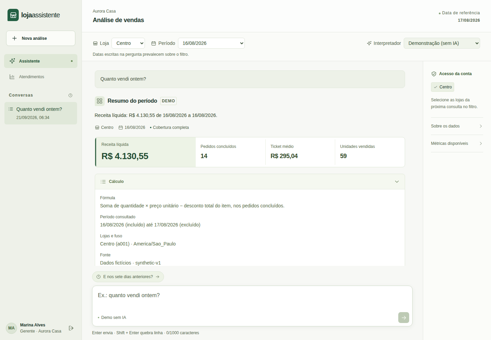

# Loja Assistente

Um gestor precisa perguntar "quanto vendi ontem?" e confiar no número, sem perder filtro, sem confundir ausência de dado com zero e sem ver venda de outra empresa. Fiz um assistente que transforma a pergunta em um plano limitado, autoriza no servidor e calcula no PostgreSQL, mostrando o mesmo cálculo que usou na resposta. Dados fictícios, roda local.



Usei FastAPI, PostgreSQL, SQLAlchemy/Alembic e Next.js/TypeScript. Avaliei o adaptador de linguagem ao vivo no Azure Foundry com o GPT-5.6 Luna: 47/48 respostas corretas, contra 24/48 do parser determinístico, em 24 perguntas repetidas duas vezes. As chamadas foram reais; os dados comerciais são sintéticos.

## Dá pra conferir sem rodar

Não precisa subir o projeto nem ter chave de IA:

```sh
python scripts/verify_evidence.py
```

O script usa só a biblioteca padrão do Python 3.11+ e recalcula as contagens a partir dos arquivos de resultado. O detalhe está em [resultado e limites](docs/azure-live-results.md), [as 48 execuções lado a lado](docs/evidence/azure-live/cases.md) e [as 55 chamadas à Azure](docs/evidence/azure-live/calls.md).

## Por que a IA não inventa o total

A IA só interpreta a pergunta. O servidor valida o plano, checa a autorização e faz a conta no banco; o número que aparece na tela é o mesmo que respondi. Isso está em [analytics/contracts.py](backend/src/loja_assistente/analytics/contracts.py), [auth/service.py](backend/src/loja_assistente/auth/service.py) e [analytics/queries.py](backend/src/loja_assistente/analytics/queries.py). [Arquitetura](docs/architecture.md).

## Rodar

Docker Desktop com engine Linux e PowerShell 7+:

```powershell
.\scripts\dev.ps1 setup
.\scripts\dev.ps1 start
```

[App](http://localhost:3102) · [API](http://localhost:8102/docs). O setup cria `.env`, faz o build, migra e carrega o seed. As contas de demonstração (`gerente.a@demo.local`, senha `LojaDemo!2026`) só autenticam com `DEMO_MODE=true`. O relógio analítico é 17/08/2026. No Linux, os comandos equivalentes estão no CI.

## Testes

`dev.ps1 test` roda 313 testes de backend, incluindo 57 avaliações de regressão offline; `dev.ps1 e2e` roda 47 casos no Playwright. Comandos e resultados em [verificação](docs/verification.md).

## Limites

Cada pergunta escolhe uma métrica. "Quanto vendi ontem só em dinheiro?" pede esclarecimento em vez de chutar o total. Pagamento, vendedor, categoria, produto e horário não cabem no plano atual, e comparações exigem cobertura completa. A base tem 6.316 pedidos fictícios em 90 dias, sem lucro, estoque, imposto ou reembolso parcial. Os testes de protocolo não medem compreensão de português, e não medi ganho de produtividade com usuários reais. [Parser demo](docs/demo-parser.md) · [métricas](docs/metrics.md) · [decisões técnicas](docs/decisoes-tecnicas.md).

FastAPI, PostgreSQL, SQLAlchemy/Alembic, Next.js/TypeScript. Licença MIT.
