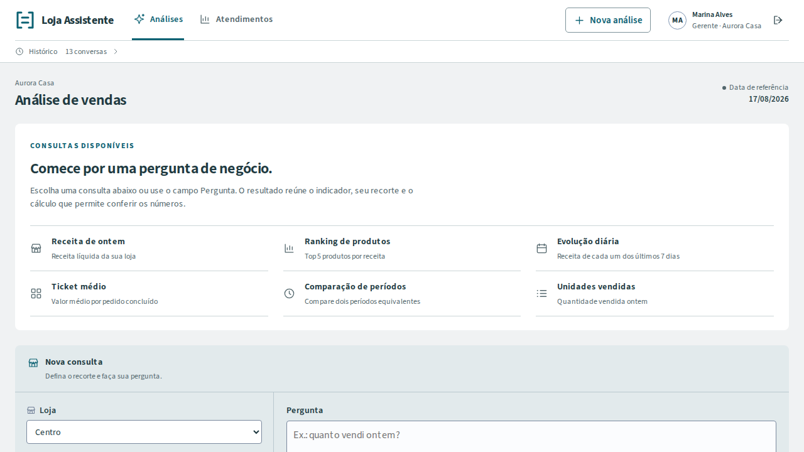
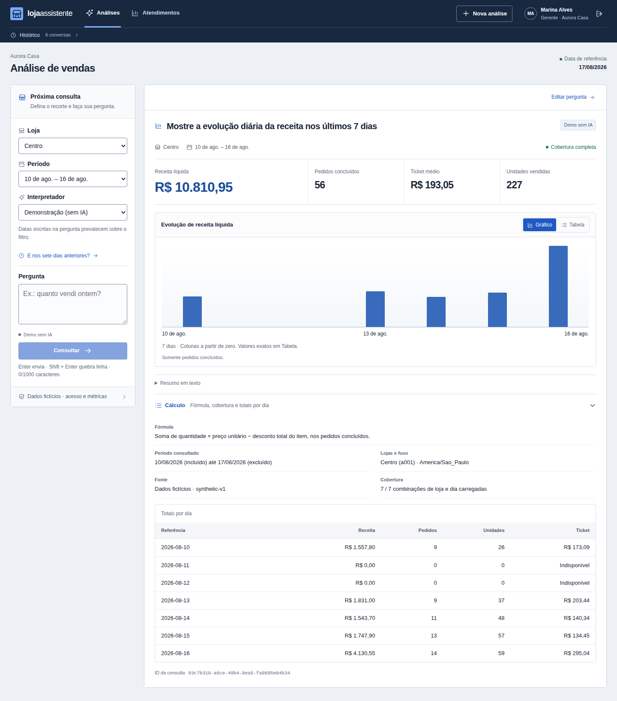

# Loja Assistente

Desenvolvi um assistente de análise de vendas para o gerente ou supervisor que precisa fazer uma pergunta e conferir o recorte e a conta. A demonstração usa lojas e vendas fictícias. O problema não é apenas somar: “Quanto vendi ontem somente em dinheiro?” não pode virar a receita geral quando o sistema não conhece a forma de pagamento.



*Tela inicial executada no [CI do commit `73aa1fff`](https://github.com/arthurjoanes/loja-assistente/actions/runs/35747541226), em 1280×720, modo Demo sem IA. As consultas usam somente lojas autorizadas; esta imagem não apresenta o resultado da conta manual abaixo. [Proveniência](docs/evidence/frontend-ci-20260922.json).*

## Uma conta pequena e um caso de consulta

Na pequena fixture manual, dois pedidos concluídos em 16/08/2026 somam **R$ 20 + R$ 10 = R$ 30**, com oito unidades e ticket de R$ 15. O pedido cancelado não entra; a loja de outra organização também não. A IA, quando habilitada, interpreta a pergunta; autorização e cálculo continuam no servidor. [Conta passo a passo](docs/problem-solution.md#uma-conta-pequena-que-pode-ser-refeita) · [decisões e código](docs/decisoes-tecnicas.md).

A imagem abaixo usa outra base: a massa maior `synthetic-v1`, loja Centro, de 10 a 16/08/2026. Seus R$ 10.810,95 não são a conta manual de R$ 30.



*Captura histórica real de 22/09/2026, rodada `f98ee948…`, modo Demo sem IA: Centro, 10–16/08, R$ 10.810,95 e cobertura 7/7. É a massa `synthetic-v1`, diferente da fixture manual de R$ 30. Confira pergunta, período e linhas do cálculo na [imagem completa](docs/screenshots/operational-proof-20260922/f98ee94864384422bd835bcabd8f3a11/01-calculation.png). A [história de consulta, recusa e recuperação](docs/operational-story.md) identifica versões e limites. A interface posterior passou no [CI do commit `73aa1fff`](https://github.com/arthurjoanes/loja-assistente/actions/runs/35747541226); a imagem acima continua vinculada à prova histórica identificada, sem transferir seus resultados: [qualidade do frontend](docs/frontend-quality.md).*

## O que eu implementei

- A passagem da pergunta a um plano estrito, com parser demo offline, adaptador estruturado e recusa de capacidades não representáveis ([interpretação](backend/src/loja_assistente/assistant/interpretation.py)).
- A autorização por organização, usuário e loja, aplicada novamente ao consultar respostas e cálculos históricos ([auth](backend/src/loja_assistente/auth/service.py), [serviço analítico](backend/src/loja_assistente/analytics/service.py)).
- As consultas predefinidas, centavos/Decimal, períodos comerciais e a distinção entre zero, ausência e cobertura parcial ([consultas](backend/src/loja_assistente/analytics/queries.py), [oráculo manual](docs/manual-fixture.md)).
- A apresentação de uma resposta selecionada, com gráfico, tabela, cálculo sob demanda e continuação separada da seleção visual ([workspace](frontend/src/features/assistant/workspace.tsx), [estado](frontend/src/features/assistant/conversation-state.ts)).
- A avaliação com casos congelados e esperado independente, além da reserva persistente de orçamento antes do despacho ao provedor ([avaliação](docs/live-evaluation.md), [orçamento e incerteza](docs/provider-budget.md)).

Integrei FastAPI, SQLAlchemy/PostgreSQL, Next.js/React e o SDK do provedor; essas bibliotecas e o modelo são de terceiros. As decisões documentadas explicam a implementação atual e seus compromissos, sem atribuir a ela experiência comercial ou uma motivação histórica não registrada.

## Conferir uma análise

1. Entre com uma conta demo e pergunte **Mostre a evolução diária da receita nos últimos 7 dias**. Confira as lojas e o período exibidos no resultado. Datas escritas na pergunta prevalecem sobre o filtro.
2. Alterne **Gráfico** e **Tabela**. Abra **Cálculo** para conferir fórmula, totais por dia e cobertura. Um dia carregado sem vendas tem zero; um dia ausente não é tratado como zero.
3. Faça outra pergunta e use **Resultados desta análise** para rever a primeira. A continuação **E nos sete dias anteriores?** usa o último plano válido da conversa, mesmo enquanto um resultado anterior está selecionado.

[Guia da interface](docs/interface.md) · [matriz de qualidade e limites](docs/frontend-quality.md) · [roteiro completo](docs/demo.md) · [três situações verificadas](docs/operational-story.md).

## Dá pra conferir sem rodar

Não precisa subir o projeto nem ter chave de IA:

```sh
python scripts/verify_evidence.py
```

O script usa só a biblioteca padrão do Python 3.11+ e recalcula as contagens a partir dos arquivos de resultado. Confere também as fontes históricas contra o freeze original e informa diferenças do código atual; não atribui a avaliação antiga às mudanças posteriores. O detalhe está em [resultado e limites](docs/azure-live-results.md), [as 48 execuções lado a lado](docs/evidence/azure-live/cases.md) e [as 55 chamadas à Azure](docs/evidence/azure-live/calls.md).

## Interpretação e cálculo separados

Quando habilitada, a IA interpreta a pergunta; no modo Demo, essa etapa usa o parser determinístico. O servidor valida o plano, checa a autorização e faz a conta no banco; texto, tabela e gráfico usam o mesmo resultado. Isso está em [analytics/contracts.py](backend/src/loja_assistente/analytics/contracts.py), [auth/service.py](backend/src/loja_assistente/auth/service.py) e [analytics/queries.py](backend/src/loja_assistente/analytics/queries.py). [Arquitetura](docs/architecture.md).

Na avaliação histórica com GPT-5.6 Luna no Azure Foundry, o caminho modelo + backend acertou 47/48 tentativas, contra 24/48 do parser determinístico, em 24 perguntas repetidas duas vezes. As chamadas foram reais; os dados comerciais são sintéticos e a falha está documentada. Esse recorte não mede a qualidade de toda pergunta possível nem foi repetido na revisão visual.

## Rodar

Docker Desktop com engine Linux e PowerShell 7+:

```powershell
.\scripts\dev.ps1 setup
.\scripts\dev.ps1 start
```

[App](http://localhost:3102) · [API](http://localhost:8102/docs). O setup cria `.env`, faz o build, migra e carrega o seed. Entre com `gerente.a@demo.local`, senha `LojaDemo!2026`, e pergunte **Quanto vendi ontem?**. Abra **Cálculo** para conferir o resultado. As contas de demonstração só autenticam com `DEMO_MODE=true`; o relógio analítico é 17/08/2026.

O modo Demo funciona sem chave nem chamadas pagas. Para habilitar o modelo, siga a [configuração OpenAI/Azure](docs/llm-integration.md). [Instalação no Linux e comandos de operação](docs/local-setup.md).

O modo com modelo tem cobrança do provedor. Na avaliação histórica, 55 chamadas somaram 48.788 tokens e US$ 0,01550395 estimados; isso não é uma fatura nem previsão para outro uso. O teto de US$ 15 daquele experimento não limita as chamadas da interface. [Consumo, preços registrados e limites](docs/azure-live-results.md#chamadas-e-consumo).

O caminho LLM da API exige [orçamento persistente por organização](docs/provider-budget.md): reserva antes do despacho, sem saldo automático, e uso incerto continua comprometido após falha ou reinício. Os tetos locais controlam admissão; não são uma garantia de cobrança monetária do provedor.

## Testes

`dev.ps1 test` roda o backend; `dev.ps1 e2e` reúne casos puros e jornadas de navegador. O backend atual passou em **364 testes** e **57 casos offline**; instalação pelo lock, lint, formato, tipos e build também passaram. O [CI do commit `73aa1fff`](https://github.com/arthurjoanes/loja-assistente/actions/runs/35747541226) aprovou **69 casos Playwright: 39 puros e 30 de navegador/HTTP**, sem falha, skip ou retry. Os [resultados e limites](docs/verification.md) identificam as versões e preservam as tentativas anteriores.

A prova histórica `f98ee948…` aprovou 68 casos (38 puros e 30 de navegador/HTTP) na composição anterior. Suas capturas não validam a fonte e a hierarquia locais posteriores. [Resultados, falhas de preparação, ambientes e limites](docs/verification.md#revisão-autoral-de-portfólio--22092026).

O proxy limita a entrada a 16 KiB e usa um prazo total de 45 s para receber o corpo e encaminhar a resposta. Leitura expirada retorna 408; corpo excessivo retorna 413. Uma resposta interrompida é apresentada como falha, sem virar resultado vazio. [Contrato e testes de robustez](docs/security.md).

## Limites

Cada pergunta escolhe uma métrica. "Quanto vendi ontem só em dinheiro?" pede esclarecimento em vez de chutar o total. Filtros por forma de pagamento, vendedor, categoria, produto específico ou horário não cabem no plano atual; o ranking de produtos é uma capacidade distinta e está disponível. Comparações exigem cobertura completa. A base tem 6.316 pedidos fictícios em 90 dias, sem lucro, estoque, imposto ou reembolso parcial. Os testes de protocolo não medem compreensão de português, e não medi ganho de produtividade com usuários reais. [Parser demo](docs/demo-parser.md) · [métricas](docs/metrics.md) · [decisões técnicas](docs/decisoes-tecnicas.md).

O design foi aprovado pelo autor em 22/09/2026. A execução automatizada do frontend foi comprovada no [CI do commit `73aa1fff`](https://github.com/arthurjoanes/loja-assistente/actions/runs/35747541226). Comparação visual pareada com o baseline, zoom nativo, leitor de tela, acessibilidade integral e desempenho percebido continuam sem comprovação. Não houve chamada paga nesta revisão.

Código sob MIT. Source Sans 3 mantém sua [licença OFL 1.1](frontend/src/app/fonts/source-sans-LICENSE.md) e [origem](frontend/src/app/fonts/sources.json).
