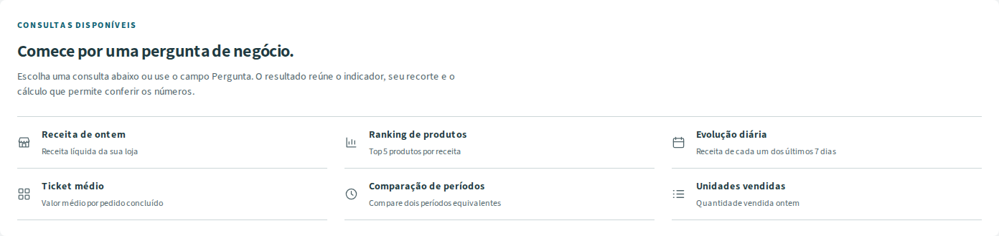
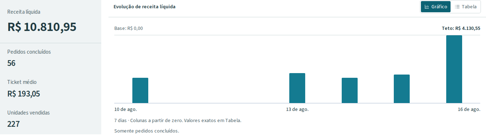

# Loja Assistente

Desenvolvi um assistente de análise de vendas para o gerente ou supervisor que precisa fazer uma pergunta e conferir as lojas, o período e a conta usados na resposta. A demonstração usa lojas e vendas fictícias. “Quanto vendi ontem somente em dinheiro?” não pode virar a receita geral quando o sistema não conhece a forma de pagamento.

[Na prática](#na-prática) · [Implementação](#implementação) · [Executar e verificar](#executar-e-verificar) · [Limites e manutenção](#limites-e-manutenção)

<p></p>

## Na prática



*Recorte real de 1392×329 px, capturado localmente em 22/09/2026 com viewport 1440×1000, sobre `6361280d`, modo Demo sem IA. [Telas atuais, reprodução e arquivo histórico](docs/image-captures.md).*

### Uma conta pequena e um caso de consulta

Na base mínima de testes `manual-v1`, “Quanto vendi ontem?” usa a referência de 17/08/2026 e consulta a loja Centro A em 16/08:

| Pedido concluído | Conta | Receita | Unidades |
| --- | --- | ---: | ---: |
| `oa3` | 2 garrafas × R$ 6 − R$ 2 de desconto + 5 ecobags × R$ 2 | R$ 20 | 7 |
| `oa4` | 1 caneca × R$ 10 | R$ 10 | 1 |
| Total | 2 pedidos distintos | **R$ 30** | **8** |

O ticket médio é R$ 30 / 2 = **R$ 15**. Um pedido cancelado de R$ 100 e as vendas de outra organização ficam fora. A pergunta entra como texto, vira um plano de consulta e retorna total, tabela e cálculo conferível. A IA, quando habilitada, interpreta a pergunta; autorização e cálculo continuam no servidor. [Teste com esperado independente](backend/tests/test_analytics.py) · [decisões e código](docs/decisoes-tecnicas.md).

A imagem abaixo usa outra base: a massa maior `synthetic-v1`, loja Centro, de 10 a 16/08/2026. Seus R$ 10.810,95 não são a conta manual de R$ 30.



*Recorte atual de 22/09/2026: Centro, 10–16/08, R$ 10.810,95, 56 pedidos e 227 unidades. [Cálculo atual com as sete linhas](docs/screenshots/current-20260922/consulta-com-calculo.png). A [prova histórica completa da rodada `f98ee948…`](docs/screenshots/operational-proof-20260922/f98ee94864384422bd835bcabd8f3a11/01-calculation.png) e a [história operacional](docs/operational-story.md) conservam a execução anterior.*

<p></p>

## Implementação

### O que eu implementei

- A passagem da pergunta a um plano estrito, com parser demo offline, adaptador estruturado e recusa de capacidades não representáveis ([interpretação](backend/src/loja_assistente/assistant/interpretation.py)).
- A autorização por organização, usuário e loja, aplicada novamente ao consultar respostas e cálculos históricos ([auth](backend/src/loja_assistente/auth/service.py), [serviço analítico](backend/src/loja_assistente/analytics/service.py)).
- As consultas predefinidas, centavos/Decimal, períodos comerciais e a distinção entre zero, ausência e cobertura parcial ([consultas](backend/src/loja_assistente/analytics/queries.py), [oráculo manual](docs/manual-fixture.md)).
- A apresentação de uma resposta selecionada, com gráfico, tabela, cálculo sob demanda e continuação separada da seleção visual ([workspace](frontend/src/features/assistant/workspace.tsx), [estado](frontend/src/features/assistant/conversation-state.ts)).
- A avaliação com casos congelados e esperado independente, além da reserva persistente de orçamento antes do despacho ao provedor ([avaliação](docs/live-evaluation.md), [orçamento e incerteza](docs/provider-budget.md)).

Integrei FastAPI, SQLAlchemy/PostgreSQL, Next.js/React e o SDK do provedor. Essas bibliotecas e o modelo são de terceiros; a composição, os contratos e os testes acima pertencem à implementação deste projeto.

### Stack

<p>
  
  
  
  
  
  
  
</p>

Python e FastAPI na API; PostgreSQL nos dados e controles; TypeScript, React e Next.js na interface. Docker Compose executa a demo; Azure OpenAI é opcional.

### Interpretação e cálculo separados

Quando habilitada, a IA interpreta a pergunta; no modo Demo, essa etapa usa o parser determinístico. O servidor valida o plano, checa a autorização e faz a conta no banco; texto, tabela e gráfico usam o mesmo resultado. Isso está em [analytics/contracts.py](backend/src/loja_assistente/analytics/contracts.py), [auth/service.py](backend/src/loja_assistente/auth/service.py) e [analytics/queries.py](backend/src/loja_assistente/analytics/queries.py). [Arquitetura](docs/architecture.md).

A documentação da Microsoft sobre [saídas estruturadas](https://learn.microsoft.com/en-us/azure/foundry/openai/how-to/structured-outputs) descreve a conformidade com um esquema JSON. Aqui o esquema restringe o plano, mas um plano válido ainda pode pedir a loja errada: a autorização é conferida novamente no servidor. Os testes usam organizações fictícias para verificar essa fronteira. Um relatório SQL com filtros resolveria as mesmas métricas; aceitar perguntas em português acrescenta conveniência a avaliar, custo e possibilidade de interpretação incorreta.

Na avaliação histórica com GPT-5.6 Luna no Azure Foundry, o caminho modelo + backend acertou 47/48 tentativas, contra 24/48 do parser determinístico, em 24 perguntas repetidas duas vezes. As chamadas foram reais; os dados comerciais são sintéticos e a falha está documentada. Esse recorte não mede a qualidade de toda pergunta possível nem foi repetido na revisão visual.

<p></p>

## Executar e verificar

### Rodar

Docker Desktop com engine Linux e PowerShell 7+:

```powershell
.\scripts\dev.ps1 setup
.\scripts\dev.ps1 start
```

[App](http://localhost:3102) · [API](http://localhost:8102/docs). O setup cria `.env`, faz o build, migra e carrega o seed. Entre com `gerente.a@demo.local`, senha `LojaDemo!2026`, e pergunte **Quanto vendi ontem?**. Abra **Cálculo** para conferir o resultado. As contas de demonstração só autenticam com `DEMO_MODE=true`; o relógio analítico é 17/08/2026.

O modo Demo funciona sem chave nem chamadas pagas. Para habilitar o modelo, siga a [configuração OpenAI/Azure](docs/llm-integration.md). [Instalação no Linux e comandos de operação](docs/local-setup.md).

O modo com modelo tem cobrança do provedor. Na avaliação histórica, 55 chamadas somaram 48.788 tokens e US$ 0,01550395 estimados; isso não é uma fatura nem previsão para outro uso. O teto de US$ 15 daquele experimento não limita as chamadas da interface. [Consumo, preços registrados e limites](docs/azure-live-results.md#chamadas-e-consumo).

O caminho LLM da API exige [orçamento persistente por organização](docs/provider-budget.md): reserva antes do despacho, sem saldo automático, e uso incerto continua comprometido após falha ou reinício. Os tetos locais controlam admissão; não são uma garantia de cobrança monetária do provedor.

### Conferir uma análise

1. Entre com uma conta demo e pergunte **Mostre a evolução diária da receita nos últimos 7 dias**. Confira as lojas e o período exibidos no resultado. Datas escritas na pergunta prevalecem sobre o filtro.
2. Alterne **Gráfico** e **Tabela**. Abra **Cálculo** para conferir fórmula, totais por dia e cobertura: quantas combinações de loja e dia foram carregadas. Um dia carregado sem vendas tem zero; um dia ausente não é tratado como zero.
3. Faça outra pergunta e use **Resultados desta análise** para rever a primeira. A continuação **E nos sete dias anteriores?** usa o último plano válido da conversa, mesmo enquanto um resultado anterior está selecionado.

[Guia da interface](docs/interface.md) · [roteiro completo](docs/demo.md).

### Dá pra conferir sem rodar

Não precisa subir o projeto nem ter chave de IA:

```sh
python scripts/verify_evidence.py
```

O script usa só a biblioteca padrão do Python 3.11+ e recalcula as contagens a partir dos arquivos de resultado. Confere também as fontes históricas contra o freeze original e informa diferenças do código atual; não atribui a avaliação antiga às mudanças posteriores. O detalhe está em [resultado e limites](docs/azure-live-results.md), [as 48 execuções lado a lado](docs/evidence/azure-live/cases.md) e [as 55 chamadas à Azure](docs/evidence/azure-live/calls.md).

### Testes

`dev.ps1 test` roda o backend; `dev.ps1 e2e` reúne casos puros e jornadas de navegador. A revisão local sobre `d702d127`, com as correções descritas em [verificação](docs/verification.md#auditoria-final-sobre-d702d127--22092026), passou em **373 testes backend**, **57 casos offline** e **69 casos Playwright: 39 puros e 30 de navegador/HTTP**, sem falha, skip ou retry. Lint, formato, tipos e build também passaram. A execução inicial encontrou uma comparação incorreta entre um ID aleatório e um valor financeiro; a regressão, a correção e os resultados anteriores permanecem no registro. Esses resultados locais não são um novo CI publicado.

O proxy limita a entrada a 16 KiB e usa um prazo total de 45 s para receber o corpo e encaminhar a resposta. Leitura expirada retorna 408; corpo excessivo retorna 413. Uma resposta interrompida é apresentada como falha, sem virar resultado vazio. [Contrato e testes de robustez](docs/security.md).

<p></p>

## Limites e manutenção

### Manter e diagnosticar

| Mudança | Onde alterar | Contrato a verificar |
| --- | --- | --- |
| Métrica, dinheiro ou período | `analytics/contracts.py` e `analytics/queries.py`, no backend | `test_analytics.py` e `test_money_contract.py`: valores manuais, fuso e cobertura |
| Permissão de loja ou histórico | `auth/service.py` e `conversations/service.py`, no backend | `test_security.py`: acesso atual, IDs alheios e ausência de SQL proibido |
| Interpretação e uso do provedor | `assistant/interpretation.py` e `assistant/budget.py`, no backend | `test_interpreters.py` e `test_budget_postgres.py`: recusa, isolamento e reserva incerta |
| Seleção e continuação na tela | `frontend/src/features/assistant/conversation-state.ts` | `frontend/e2e/result-selection.spec.ts`: seleção não altera o último plano válido |

Execute as suítes indicadas em **Testes** após mudar esses contratos. Para uma falha local, confira `dev.ps1 status` e `dev.ps1 logs`, o `request_id` mostrado em **Cálculo** e o [guia de operação](docs/local-setup.md). Relate problemas nas [issues do repositório](https://github.com/arthurjoanes/loja-assistente/issues), com passos, versão e mensagem sanitizada, sem chaves ou dados pessoais.

### Limites

Cada pergunta escolhe uma métrica. "Quanto vendi ontem só em dinheiro?" pede esclarecimento em vez de chutar o total. Filtros por forma de pagamento, vendedor, categoria, produto específico ou horário não cabem no plano atual; o ranking de produtos é uma capacidade distinta e está disponível. Comparações exigem cobertura completa. A base tem 6.316 pedidos fictícios em 90 dias, sem lucro, estoque, imposto ou reembolso parcial. Os testes de protocolo não medem compreensão de português, e não medi ganho de produtividade com usuários reais. [Parser demo](docs/demo-parser.md) · [métricas](docs/metrics.md) · [decisões técnicas](docs/decisoes-tecnicas.md).

Este repositório entrega uma demonstração local. Comparação visual pareada, zoom nativo, leitor de tela, acessibilidade integral e desempenho percebido continuam sem comprovação; as jornadas automatizadas têm o escopo registrado em [verificação](docs/verification.md). Implantação pública exige configuração própria de identidade, HTTPS, cookies e proteção operacional.

Código sob MIT. Source Sans 3 mantém sua [licença OFL 1.1](frontend/src/app/fonts/source-sans-LICENSE.md) e [origem](frontend/src/app/fonts/sources.json).

Ícones da stack: [Devicon — licença MIT](docs/stack/LICENSE.devicon).
