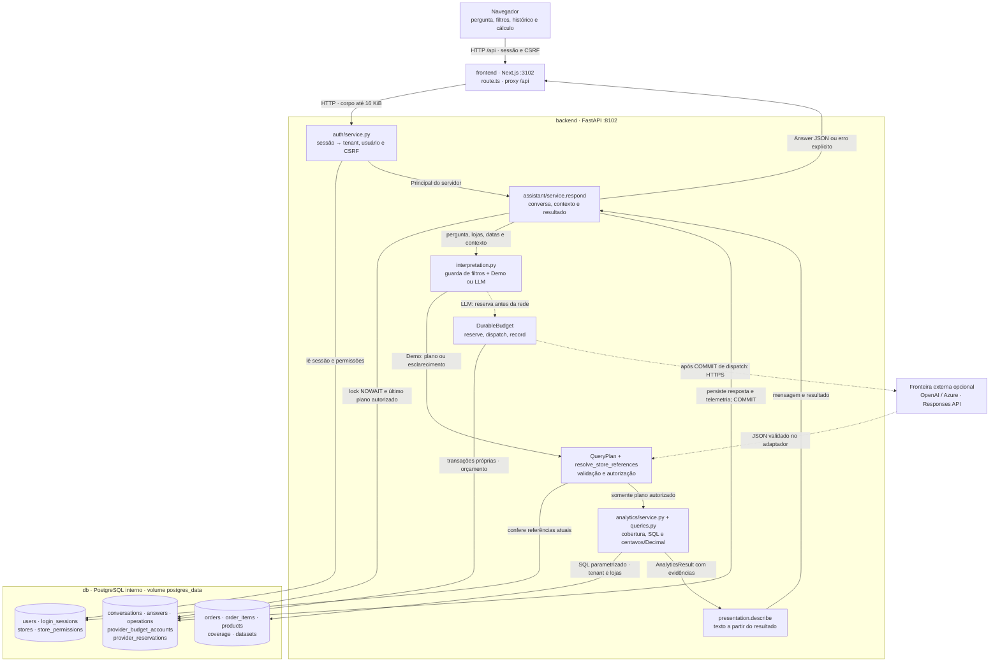
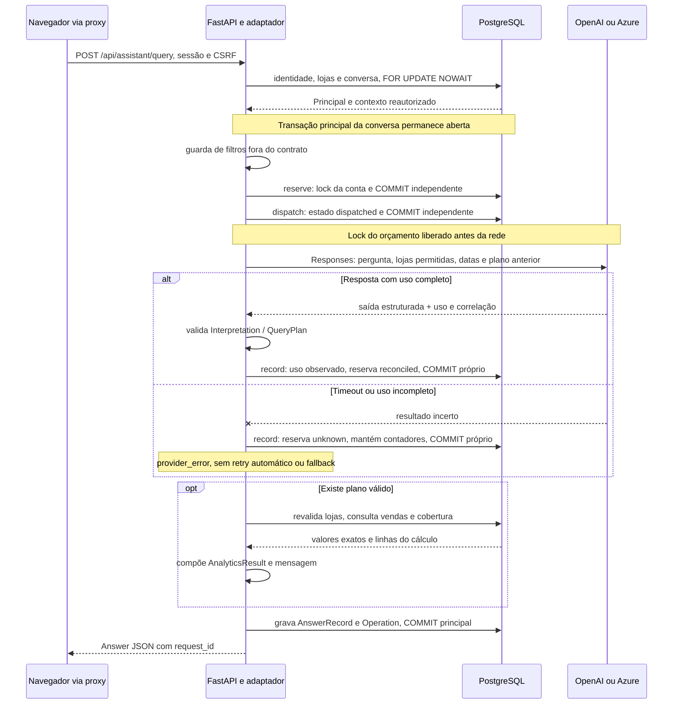

# Arquitetura do Loja Assistente

## Interpretação

[Problema e matriz](problem-solution.md). O caminho Responses v1 aceita OpenAI ou endpoint Azure de inferência configurado no servidor, usando o mesmo SDK/contrato. Endpoint de projeto e URLs com credenciais são recusados antes da rede; `model` no Azure é o nome do deployment. Não há segundo framework de provedor.

O adaptador v5 usa um schema de transporte compatível com Azure e valida novamente no mesmo Pydantic de domínio antes de consultar. O esforço de raciocínio pode ser omitido ou configurado; o deployment Luna foi avaliado com none. Conserva somente metadata permitida de uso/correlação, inclusive quando o parsing falha, e fornece hooks de avaliação por contexto da requisição. O runner usa o endpoint FastAPI e PostgreSQL descartável; reserva orçamento persistente antes de enviar cada tentativa, sem retries ou fallback. O modo offline não acessa o provedor. [Protocolo e limites](live-evaluation.md). A [avaliação Azure](azure-live-results.md) passou nos limiares definidos antes; os testes de contrato simulado permanecem separados.

Prefixos de cortesia são removidos apenas no início da guarda/parser; qualificadores posteriores permanecem sujeitos à recusa. O demo v4 aceita pronome em “quanto eu vendi” e ajuda numa saudação isolada. Essas correções não transformam o parser em modelo nem mostram generalização.

## Problema, usuários e limites

Gestores consultam receita, pedidos, ticket, unidades, ranking e evolução em português e conferem o cálculo. Aurora Casa e Brisa Casa são organizações independentes, cada uma com Centro, Jardins e Norte. Gerente A vê a001; supervisor A vê a001/a002; gerente B vê b001. Lucro, estoque, previsão, causalidade, clientes, tributação e reembolsos parciais não são suportados.

## Componentes e fluxo

O [Compose](../compose.yaml) executa `frontend`, `backend` e `db`. Interpretação, orçamento e cálculo são módulos do mesmo backend Python; não há worker, broker ou fila de perguntas. O navegador mantém uma única origem, e o route handler Next encaminha `/api` para `http://backend:8102`.

Os três cilindros agrupam tabelas do **mesmo** banco. As setas pontilhadas indicam modo LLM opcional, não processamento assíncrono. No caminho sem plano, `respond` persiste a orientação ou o erro do provedor e encerra sem consulta de vendas; os nós de cálculo só são atravessados quando existe plano válido.

| Parte e fonte | Responsabilidade concreta | Saída / limite |
| --- | --- | --- |
| [Proxy Next](../frontend/src/app/api/%5B...path%5D/route.ts) | Encaminha método, query, Origin, CSRF e apenas o cookie `la_session` | `no-store`, corpo até 16 KiB e deadline total de 45 s; não decide tenant |
| [Sessão e permissões](../backend/src/loja_assistente/auth/service.py) | Produz `Principal` e resolve lojas dentro da organização | Texto da pergunta e plano não podem alterar identidade |
| [Orquestração](../backend/src/loja_assistente/assistant/service.py) | Reautoriza conversa, trava com `NOWAIT`, interpreta, calcula e grava | `AnswerRecord`, último plano válido e `Operation` por tenant/usuário |
| [Interpretação](../backend/src/loja_assistente/assistant/interpretation.py) e [adaptador](../backend/src/loja_assistente/assistant/interpreters/openai_adapter.py) | Recusa filtros fora do contrato e escolhe Demo/LLM | `Interpretation` Pydantic; nunca recebe linhas de venda ou credenciais no contexto |
| [Orçamento](../backend/src/loja_assistente/assistant/budget.py) | Serializa conta da organização e confirma reserva/despacho/uso | Ledger durável independente do commit da conversa |
| [Consulta](../backend/src/loja_assistente/analytics/queries.py) e [serviço analítico](../backend/src/loja_assistente/analytics/service.py) | Revalida lojas, lê cobertura e executa aggregate/ranking/daily | Centavos/Decimal, fórmula, linhas, escopo, cobertura e versão do dataset |
| [Apresentação](../backend/src/loja_assistente/assistant/presentation.py) e [resultado visual](../frontend/src/features/analytics/result.tsx) | Produz texto e exibe gráfico/tabela sobre o resultado calculado | O modelo não escreve a resposta financeira; cliente não recalcula receita |

Python 3.12, Pydantic 2, SQLAlchemy 2, Alembic, Next.js 16, React 19, TypeScript, Node 24 e PostgreSQL 17. Dependências em [`backend/uv.lock`](../backend/uv.lock) e [`frontend/package-lock.json`](../frontend/package-lock.json). O Compose publica `127.0.0.1:3102/8102`, mantém o banco interno e persiste `postgres_data`. O script de operação aplica migrações e seed; o frontend espera a saúde do backend. Não existe sincronização com ERP ou fonte de vendas em produção: as tabelas vêm do seed sintético.

O banco usa um único papel; a autorização por tenant/loja é aplicada pelo backend, apoiada por chaves compostas. A separação dos módulos do diagrama não cria isolamento de credenciais no PostgreSQL.

### Sequência de uma pergunta no modo LLM

No modo Demo, a interpretação é local e não cria reserva. A guarda de filtros vem antes dos dois interpretadores; esclarecimentos terminam sem consulta analítica. O endpoint estruturado `/api/analytics/query` entra diretamente pelo plano, mantendo sessão, CSRF e a mesma autorização em `execute_query`.

A transação principal pode manter o lock da conversa durante a chamada de rede. Uma segunda pergunta para a mesma conversa recebe 409; o lock da conta de orçamento é independente e curto. Se o processo cair depois de `dispatch`, a reserva permanece durável mesmo que a resposta e a conversa não sejam confirmadas. O diagrama descreve essa persistência local, não uma transação atômica com o provedor.

## Identidade e mapa de autorização

1. Cookie opaco la_session, HttpOnly, SameSite=Lax, sessão armazenada no banco como digest; expiração usa relógio real. Senhas Argon2. Identidade e tenant são derivados exclusivamente da sessão.
2. Toda mutação requer Origin permitido; depois do login também X-CSRF-Token vinculado à sessão. Login aceita somente JSON e Origin conhecido. Proxy Next mantém uma origem no navegador. Secure habilitável para HTTPS.
3. Interpretador recebe apenas referências de lojas atualmente permitidas, referência analítica, filtros visuais e último plano validado da conversa pertencente ao usuário. Nunca recebe dump de vendas, senha ou sessão.
4. Referências explícitas são resolvidas e autorizadas. Referência desconhecida/proibida recebe erro genérico 403. Ambiguidade gera esclarecimento. Tenant/user/SQL extras são rejeitados pelo contrato.
5. Acesso a analytics reconsulta permissões no banco e aplica tenant e store em todos os joins, inclusive produtos/itens e cobertura. Nenhum acesso analítico ocorre antes desta verificação. Consultas têm parâmetros, janelas de até 90 dias, ranking de até 20 e statement_timeout.
6. Histórico, conversa, resposta, cálculo e métricas operacionais filtram tenant+user. Cálculos persistidos revalidam lojas atuais antes de sair. Troca de usuário não reutiliza estado global. Sem cache.
7. Logs incluem request_id, modo, capacidade, status e durações, mas não pergunta, corpo, senha nem token. Telemetria é pessoal; tokens/custo são indisponíveis sem medição.

## Modelo de dados

A admissão do modo LLM usa uma conta PostgreSQL por organização e reservas duráveis, com lock apenas nas transações curtas do orçamento. A reserva e o despacho são confirmados antes da rede; uma falha na transação da conversa não os desfaz. Uso incerto conserva a reserva, sem expiração automática. A migração 0003 acrescenta esse ledger sem conceder saldo. [Estados, operação e limites](provider-budget.md).

Organização → lojas/produtos/usuários. Permissões ligam usuário e loja. Pedidos possuem tenant, loja, identificador de origem, instante UTC e status; itens possuem tenant, pedido, produto, quantidade, preço unitário e desconto total do item em centavos. Chaves estrangeiras compostas e unicidade por tenant impedem cruzamentos acidentais. Cobertura tem uma linha por tenant/loja/data comercial carregada. Dataset guarda versão e configuração. Sessões, conversas, respostas e telemetria são persistidas. Nomes e IDs externos coincidem entre organizações intencionalmente.

### Relações e leitores dos dados

| Grupo de tabelas | Chave / relação relevante | Quem usa |
| --- | --- | --- |
| `organizations`, `users`, `stores`, `store_permissions` | Permissão liga tenant, usuário e loja; lojas de organizações distintas podem compartilhar nome | Sessão, interpretação e autorização de consulta/histórico |
| `orders`, `order_items`, `products` | FKs compostas incluem tenant; pedido é único por tenant/ID externo; item aponta pedido e produto do mesmo tenant | SQL predefinido, apenas pedidos `completed` |
| `coverage`, `datasets` | Cobertura única por tenant/loja/data comercial; dataset guarda versão e manifesto | Distingue zero de dia ausente e identifica a base do cálculo |
| `login_sessions` | Digest da sessão, usuário/tenant, CSRF e expiração real | Autenticação em cada requisição |
| `conversations`, `answers` | Resposta vinculada por tenant/usuário/conversa; payload JSONB conserva plano e resultado | Continuação, histórico e endpoint de cálculo com nova autorização |
| `operations` | Tenant, usuário e `request_id` com status e durações | Painel operacional e logs sem conteúdo da pergunta |
| `provider_budget_accounts`, `provider_reservations` | Conta por tenant; reserva identificada por tenant/`call_id` e vinculada a usuário/`request_id` | Admissão e reconciliação de uso em transações independentes |

As relações e restrições estão em [`models.py`](../backend/src/loja_assistente/models.py). O resultado persistido é uma fotografia da consulta executada; ler **Cálculo** reautoriza as lojas e devolve essa evidência, sem refazer a consulta sobre uma base que possa ter mudado.

## Contratos

Fonte de integração: [contrato HTTP](api-contract.md). Plano estrito com intent=aggregate|ranking|daily, metric=revenue|orders|average_ticket|units, store_references, period={start,end}, comparison=previous_period|null, grouping=day|null, limit. Datas são ISO, end exclusivo. Interpretador retorna status=ready|needs_clarification|unsupported, plan ou null e mensagem. Resultado inclui totais, rows, linhas diárias (`evidence`), cobertura, comparação, unidade/fórmula, escopo, fuso, versão e request_id. Dinheiro é inteiro em centavos no Python e string decimal na saída JSON, inclusive totais e linhas diárias; ticket e percentual também são strings Decimal. A multiplicação em SQL e o CHECK de desconto usam NUMERIC antes de multiplicar quantidade por preço BIGINT. A migração 0002 troca apenas essa restrição; não reescreve respostas antigas. Texto e gráfico leem este único objeto.

## Riscos e testes

Valores financeiros esperados calculados à mão, independentes da massa; integração obrigatória em PostgreSQL real. Testar limite UTC/São Paulo, contagem distinta, centavos, zero/ausência/parcial, empates, períodos equivalentes e base zero. Testar expiração, CSRF, referência adulterada, plano malicioso, duas sessões alternadas e acesso direto a recursos alheios; inspecionar que o repositório não recebeu consulta proibida. Adaptador OpenAI com schema estrito, timeout, sem retry automático nem fallback oculto; execução paga exige ativação explícita e fica fora da validação local. Casos de avaliação versionados, com relatório por categoria, separadas dos exemplos da UI. Jornadas reais de navegador, transições de sessão, campos e falhas, responsividade e capturas reais; contagens históricas por execução em [verificação](verification.md). CI usa comandos internos iguais ao Compose local.

## Fontes consultadas

- [Documentação oficial](https://developers.openai.com/api/docs/guides/structured-outputs) — saída estruturada e validação posterior. Referência histórica; conferir disponibilidade antes de novo uso.
- [Documentação oficial](https://nextjs.org/docs/app/getting-started/installation) — requisitos de Node e App Router.
- [Documentação oficial](https://fastapi.tiangolo.com/tutorial/testing/) — testes HTTP.

## Execução e concorrência

PostgreSQL fixado em 17.11-bookworm nos ambientes de demonstração e testes. E2E usa `compose.e2e.yaml`, projeto `pf-loja-assistente-e2e`, banco tmpfs e nenhuma porta host; sobe migrações e seed antes da saúde da API. Não usa `.env` com credenciais ou chave de IA da demonstração. `dev.ps1 e2e` encerra apenas esse ambiente em `finally`, inclusive após falhas.

Perguntas da mesma conversa usam `SELECT FOR UPDATE NOWAIT`: uma segunda solicitação recebe 409 em vez de aguardar o provedor segurando outra conexão. O teste de concorrência usa duas conexões PostgreSQL independentes e confirma aquisição após commit. Não há fila distribuída nem promessa de alta demanda. Pool espera até 5 s por conexão; conexão nova tem timeout de 5 s; comandos de banco têm limite de 10 s e consultas analíticas de 3 s. O timeout do SDK é de comunicação, não deadline total da requisição. Proxy: 45 s totais desde a leitura do corpo até o fim da resposta; cliente: 50 s. Cancelar o fetch não garante interromper trabalho já iniciado no servidor Python.

Todos os planos históricos são reautorizados para lista/detalhe/continuação: uma pergunta recente autorizada não torna visível o título de uma consulta anterior revogada. A checagem no acesso ao cálculo (`/answers/{id}/evidence`) permanece independente. O plano não admite filtros de pagamento, horário, vendedor ou produto individual; a guarda inicial recusa essas intenções antes de consultar ou chamar provedor. O parser demo usa vocabulário limitado; o LLM mantém validação de schema e autorização posterior.

### Falhas e efeito persistido

| Situação | Comportamento implementado | Verificação no código de teste |
| --- | --- | --- |
| Duas perguntas simultâneas na mesma conversa | `NOWAIT` recusa a segunda com 409; não enfileira chamadas ao provedor | [`test_concurrency.py`](../backend/tests/test_concurrency.py) |
| Loja revogada após uma resposta antiga | Histórico, continuação e cálculo reconsultam autorização antes de expor o resultado | [`test_security.py`](../backend/tests/test_security.py) |
| Timeout após despacho ou rollback da resposta | A reserva continua debitada como uso incerto; não expira nem é devolvida automaticamente | [`test_budget_postgres.py`](../backend/tests/test_budget_postgres.py) |
| Cobertura ausente/parcial ou período anterior zero | Ausência não vira zero; comparação exige cobertura completa e percentual não divide por zero | [`test_analytics.py`](../backend/tests/test_analytics.py) |
| Proxy expira ou navegador cancela | HTTP é encerrado; trabalho já iniciado no Python pode continuar e confirmar dados | [`proxy-streams.spec.ts`](../frontend/e2e/proxy-streams.spec.ts) |

## Organização do código

`assistant/service.respond` coordena identidade, conversa, interpretação, autorização, consulta e persistência, com telemetria explícita. A decisão demo/LLM, configuração do SDK e guarda anterior ao provedor estão em `assistant/interpretation.py`. A gramática divide capacidade/vocabulário, datas/continuação e referências de loja em módulos específicos, sem framework de parsing.

No cliente, `workspace.tsx` compõe os componentes e controla foco/rolagem; `use-workspace.ts` coordena sessão, HTTP e respostas atrasadas. `conversation-state.ts` concentra transições atômicas de resposta, histórico e troca de identidade; `period-selection.ts` valida datas reais, além da diferença de dias. `analytics/result.tsx` apresenta o resultado, `visualization.tsx` cuida de gráfico/tabela e `evidence.tsx` da leitura autorizada, erro e recuperação do cálculo. Nenhum componente calcula receita.

O bootstrap distingue 401 inicial de expiração entre identificação e histórico. Geração de sessão e revisão de histórico impedem retorno tardio sobre identidade nova. O painel Cálculo ignora retornos após desmontagem: um 401 antigo não encerra a nova sessão. Atendimentos que falham ao atualizar conservam a última amostra com aviso explícito de desatualização. Um ref de envio impede duplicação antes do próximo render. Esses controles complementam, sem substituir, a autorização no servidor.

API e proxy limitam corpos de entrada a 16 KiB, contando chunks antes do decode. O limite de 1.000 caracteres da pergunta continua sendo regra do contrato, independente do limite de transporte.

`lib/server/proxy-lifetime.ts` controla deadline, desconexão e encaminhamento do
corpo da resposta. O reader não fica preso esperando o hook de cancelamento da
origem. Encerramento normal remove timer/listener; expiração ou cancelamento
propagam a interrupção e liberam o reader. `request-body.ts` converte somente a
expiração de leitura em 408, preservando 413 para excesso. O frontend rejeita JSON
interrompido como erro explícito. [Validação e limites](security.md).

## Alternativa simples e hipótese de utilidade

O público pretendido é quem consulta indicadores de lojas e precisa conferir o recorte usado. As organizações e vendas desta demonstração são sintéticas; não comprovam adoção comercial. Um relatório SQL com filtros pode resolver as mesmas métricas sem modelo. Aqui a interpretação em português é uma hipótese de redução do esforço de entrada, enquanto plano limitado e consultas predefinidas conservam o cálculo verificável. Não houve estudo que prove produtividade superior. O [protocolo preparado](usage-comparison.md) define como comparar essa hipótese com os controles existentes, sem inventar participantes ou um dashboard separado.

Separar interpretação e cálculo impede que uma frase plausível substitua uma conta definida, mas custa manter uma matriz de capacidades e recusar pedidos fora dela. Um modelo pode interpretar melhor algumas formulações e ainda pedir esclarecimento desnecessário, como na falha histórica `final-bf-04`. Evoluir para SQL livre, RAG ou novos serviços não decorre desse resultado: exige outro problema e outro contrato de verificação.

## Código e evidências relacionados

| Tema                             | Implementação e critérios                                                                                                                                                          |
| -------------------------------- | ---------------------------------------------------------------------------------------------------------------------------------------------------------------------------------- |
| Interpretação                    | [`interpretation.py`](../backend/src/loja_assistente/assistant/interpretation.py) · [`openai_adapter.py`](../backend/src/loja_assistente/assistant/interpreters/openai_adapter.py) |
| Problema, usuários e limites     | [`seed.py`](../backend/src/loja_assistente/seed.py) · [`analytics/contracts.py`](../backend/src/loja_assistente/analytics/contracts.py)                                            |
| Componentes e fluxo              | [`assistant/service.py`](../backend/src/loja_assistente/assistant/service.py) · [`analytics/service.py`](../backend/src/loja_assistente/analytics/service.py)                      |
| Identidade e mapa de autorização | [`auth/service.py`](../backend/src/loja_assistente/auth/service.py) · [`conversations/service.py`](../backend/src/loja_assistente/conversations/service.py)                        |
| Modelo de dados                  | [`models.py`](../backend/src/loja_assistente/models.py) · [`budget.py`](../backend/src/loja_assistente/assistant/budget.py)                                                        |
| Contratos                        | [`queries.py`](../backend/src/loja_assistente/analytics/queries.py)                                                                                                                |
| Riscos e testes                  | [`test_analytics.py`](../backend/src/loja_assistente/../../tests/test_analytics.py) · [`test_security.py`](../backend/src/loja_assistente/../../tests/test_security.py)            |
| Execução e concorrência          | [`database.py`](../backend/src/loja_assistente/database.py)                                                                                                                        |
