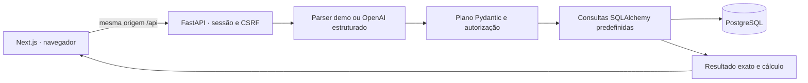

# Arquitetura do Loja Assistente

Atualizado em 22/09/2026 UTC.

## Interpretação

[Problema e matriz](problem-solution.md). O caminho Responses v1 aceita OpenAI ou endpoint Azure de inferência configurado no servidor, usando o mesmo SDK/contrato. Endpoint de projeto e URLs com credenciais são recusados antes da rede; `model` no Azure é o nome do deployment. Não há segundo framework de provedor.

O adaptador v5 usa um schema de transporte compatível com Azure e valida novamente no mesmo Pydantic de domínio antes de consultar. O esforço de raciocínio pode ser omitido ou configurado; o deployment Luna foi avaliado com none. Conserva somente metadata permitida de uso/correlação, inclusive quando o parsing falha, e fornece hooks de avaliação por contexto da requisição. O runner usa o endpoint FastAPI e PostgreSQL descartável; reserva orçamento persistente antes de enviar cada tentativa, sem retries ou fallback. O modo offline não acessa o provedor. [Protocolo e limites](live-evaluation.md). A [avaliação Azure](azure-live-results.md) passou nos limiares definidos antes; os testes de contrato simulado permanecem separados.

Prefixos de cortesia são removidos apenas no início da guarda/parser; qualificadores posteriores permanecem sujeitos à recusa. O demo v4 aceita pronome em “quanto eu vendi” e ajuda numa saudação isolada. Essas correções não transformam o parser em modelo nem mostram generalização.

## Problema, usuários e limites
Gestores consultam receita, pedidos, ticket, unidades, ranking e evolução em português e conferem o cálculo. Aurora Casa e Brisa Casa são organizações independentes, cada uma com Centro, Jardins e Norte. Gerente A vê a001; supervisor A vê a001/a002; gerente B vê b001. Lucro, estoque, previsão, causalidade, clientes, tributação e reembolsos parciais não são suportados.

## Componentes e fluxo

Python 3.12, Pydantic 2, SQLAlchemy 2, Alembic, Next.js 16, React 19, TypeScript, Node 24 e PostgreSQL 17. Dependências em `backend/uv.lock` e `frontend/package-lock.json`. Compose `pf-loja-assistente`, portas 3102/8102, banco interno.

O monólito mantém interpretação e consulta no mesmo processo. O banco usa um único papel; autorização fica nas consultas por loja e tenant, com chaves compostas e testes.

## Identidade e mapa de autorização
1. Cookie opaco la_session, HttpOnly, SameSite=Lax, sessão armazenada no banco como digest; expiração usa relógio real. Senhas Argon2. Identidade e tenant são derivados exclusivamente da sessão.
2. Toda mutação requer Origin permitido; depois do login também X-CSRF-Token vinculado à sessão. Login aceita somente JSON e Origin conhecido. Proxy Next mantém uma origem no navegador. Secure habilitável para HTTPS.
3. Interpretador recebe apenas referências de lojas atualmente permitidas, referência analítica, filtros visuais e último plano validado da conversa pertencente ao usuário. Nunca recebe dump de vendas, senha ou sessão.
4. Referências explícitas são resolvidas e autorizadas. Referência desconhecida/proibida recebe erro genérico 403. Ambiguidade gera esclarecimento. Tenant/user/SQL extras são rejeitados pelo contrato.
5. Acesso a analytics reconsulta permissões no banco e aplica tenant e store em todos os joins, inclusive produtos/itens e cobertura. Nenhum acesso analítico ocorre antes desta verificação. Consultas têm parâmetros, janelas de até 90 dias, ranking de até 20 e statement_timeout.
6. Histórico, conversa, resposta, cálculo e métricas operacionais filtram tenant+user. Cálculos persistidos revalidam lojas atuais antes de sair. Troca de usuário não reutiliza estado global. Sem cache.
7. Logs incluem request_id, modo, capacidade, status e durações, mas não pergunta, corpo, senha nem token. Telemetria é pessoal; tokens/custo são indisponíveis sem medição.

## Modelo de dados

A admissão do modo LLM usa uma conta PostgreSQL por organização e reservas duráveis, com lock apenas nas transações curtas do orçamento. A reserva e o despacho são confirmados antes da rede; uma falha na transação da conversa não os desfaz. Uso incerto conserva a reserva, sem expiração automática. A migração 0003 acrescenta esse ledger sem conceder saldo. [Estados, operação e limites](provider-budget.md).

Organização → lojas/produtos/usuários. Permissões ligam usuário e loja. Pedidos possuem tenant, loja, identificador de origem, instante UTC e status; itens possuem tenant, pedido, produto, quantidade, preço unitário e desconto total do item em centavos. Chaves estrangeiras compostas e unicidade por tenant impedem cruzamentos acidentais. Cobertura tem uma linha por tenant/loja/data comercial carregada. Dataset guarda versão e configuração. Sessões, conversas, respostas e telemetria são persistidas. Nomes e IDs externos coincidem entre organizações intencionalmente.

## Contratos
Fonte de integração: docs/api-contract.md. Plano estrito com intent=aggregate|ranking|daily, metric=revenue|orders|average_ticket|units, store_references, period={start,end}, comparison=previous_period|null, grouping=day|null, limit. Datas são ISO, end exclusivo. Interpretador retorna status=ready|needs_clarification|unsupported, plan ou null e mensagem. Resultado inclui totais, rows, linhas diárias (`evidence`), cobertura, comparação, unidade/fórmula, escopo, fuso, versão e request_id. Dinheiro é inteiro em centavos no Python e string decimal na saída JSON, inclusive totais e linhas diárias; ticket e percentual também são strings Decimal. A multiplicação em SQL e o CHECK de desconto usam NUMERIC antes de multiplicar quantidade por preço BIGINT. A migração 0002 troca apenas essa restrição; não reescreve respostas antigas. Texto e gráfico leem este único objeto.

## Riscos e testes
Valores financeiros esperados calculados à mão, independentes da massa; integração obrigatória em PostgreSQL real. Testar limite UTC/São Paulo, contagem distinta, centavos, zero/ausência/parcial, empates, períodos equivalentes e base zero. Testar expiração, CSRF, referência adulterada, plano malicioso, duas sessões alternadas e acesso direto a recursos alheios; inspecionar que o repositório não recebeu consulta proibida. Adaptador OpenAI com schema estrito, timeout, sem retry automático nem fallback oculto; execução paga exige ativação explícita e fica fora da validação local. Avaliações versionadas (40+) com relatório por categoria, separadas dos exemplos da UI. Jornadas reais de navegador, transições de sessão, campos e falhas, responsividade e capturas reais; contagens atuais em verification.md. CI usa comandos internos iguais ao Compose local.

## Fontes consultadas
- https://developers.openai.com/api/docs/guides/structured-outputs — saída estruturada e validação posterior.
- https://nextjs.org/docs/app/getting-started/installation — requisitos de Node e App Router.
- https://fastapi.tiangolo.com/tutorial/testing/ — testes HTTP.

## Execução e concorrência

PostgreSQL fixado em 17.11-bookworm nos ambientes de demonstração e testes. E2E usa `compose.e2e.yaml`, projeto `pf-loja-assistente-e2e`, banco tmpfs e nenhuma porta host; sobe migrações e seed antes da saúde da API. Não usa `.env` com credenciais ou chave de IA da demonstração. `dev.ps1 e2e` encerra apenas esse ambiente em `finally`, inclusive após falhas.

Perguntas da mesma conversa usam `SELECT FOR UPDATE NOWAIT`: uma segunda solicitação recebe 409 em vez de aguardar o provedor segurando outra conexão. O teste de concorrência usa duas conexões PostgreSQL independentes e confirma aquisição após commit. Não há fila distribuída nem promessa de alta demanda. Pool espera até 5 s por conexão; conexão nova tem timeout de 5 s; comandos de banco têm limite de 10 s e consultas analíticas de 3 s. O timeout do SDK é de comunicação, não deadline total da requisição. Proxy: 45 s totais desde a leitura do corpo até o fim da resposta; cliente: 50 s. Cancelar o fetch não garante interromper trabalho já iniciado no servidor Python.

Todos os planos históricos são reautorizados para lista/detalhe/continuação: uma pergunta recente autorizada não torna visível o título de uma consulta anterior revogada. A checagem no acesso ao cálculo (`/answers/{id}/evidence`) permanece independente. O plano não admite filtros de pagamento, horário, vendedor ou produto individual; a guarda inicial recusa essas intenções antes de consultar ou chamar provedor. O parser demo usa vocabulário limitado; o LLM mantém validação de schema e autorização posterior.

## Organização do código

`assistant/service.respond` coordena identidade, conversa, interpretação, autorização, consulta e persistência, com telemetria explícita. A decisão demo/LLM, configuração do SDK e guarda anterior ao provedor estão em `assistant/interpretation.py`. A gramática divide capacidade/vocabulário, datas/continuação e referências de loja em módulos específicos, sem framework de parsing.

No cliente, `workspace.tsx` compõe os componentes e controla foco/rolagem; `use-workspace.ts` coordena sessão, HTTP e respostas atrasadas. `conversation-state.ts` concentra transições atômicas de resposta, histórico e troca de identidade; `period-selection.ts` valida datas reais, além da diferença de dias. `analytics/result.tsx` apresenta o resultado, `visualization.tsx` cuida de gráfico/tabela e `evidence.tsx` da leitura autorizada, erro e recuperação do cálculo. Nenhum componente calcula receita.

O bootstrap distingue 401 inicial de expiração entre identificação e histórico. Geração de sessão e revisão de histórico impedem retorno tardio sobre identidade nova. O painel Cálculo ignora retornos após desmontagem: um 401 antigo não encerra a nova sessão. Atendimentos que falham ao atualizar conservam a última amostra com aviso explícito de desatualização. Um ref de envio impede duplicação antes do próximo render. Esses controles complementam, sem substituir, a autorização no servidor.

API e proxy limitam corpos de entrada a 16 KiB, contando chunks antes do decode. O limite de 1.000 caracteres da pergunta continua sendo regra do contrato, independente do limite de transporte.

`lib/server/proxy-lifetime.ts` controla deadline, desconexão e encaminhamento do
corpo da resposta. O reader não fica preso esperando o hook de cancelamento da
origem. Encerramento normal remove timer/listener; expiração ou cancelamento
propagam a interrupção e liberam o reader. `request-body.ts` converte somente a
expiração de leitura em 408, preservando 413 para excesso. O frontend rejeita JSON
interrompido como erro explícito. [Validação e limites](security.md).

## Alternativa simples e hipótese de utilidade

O público pretendido é quem consulta indicadores de lojas e precisa conferir o recorte usado. As organizações e vendas desta demonstração são sintéticas; não comprovam adoção comercial. Um relatório SQL com filtros pode resolver as mesmas métricas sem modelo. Aqui a interpretação em português é uma hipótese de redução do esforço de entrada, enquanto plano limitado e consultas predefinidas conservam o cálculo verificável. Não houve estudo que prove produtividade superior. O [protocolo preparado](usage-comparison.md) define como comparar essa hipótese com os controles existentes, sem inventar participantes ou um dashboard separado.

Separar interpretação e cálculo impede que uma frase plausível substitua uma conta definida, mas custa manter uma matriz de capacidades e recusar pedidos fora dela. Um modelo pode interpretar melhor algumas formulações e ainda pedir esclarecimento desnecessário, como na falha histórica `final-bf-04`. Evoluir para SQL livre, RAG ou novos serviços não decorre desse resultado: exige outro problema e outro contrato de verificação.
