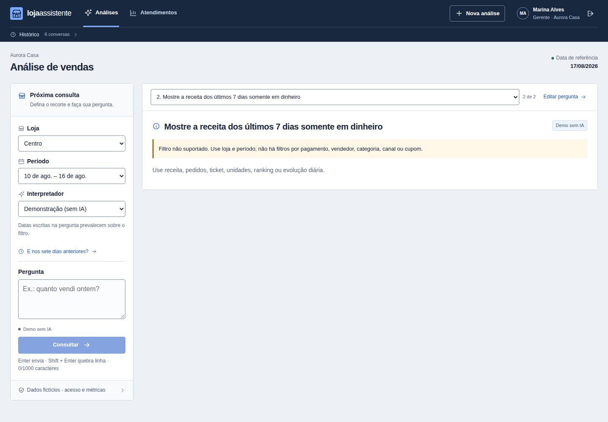
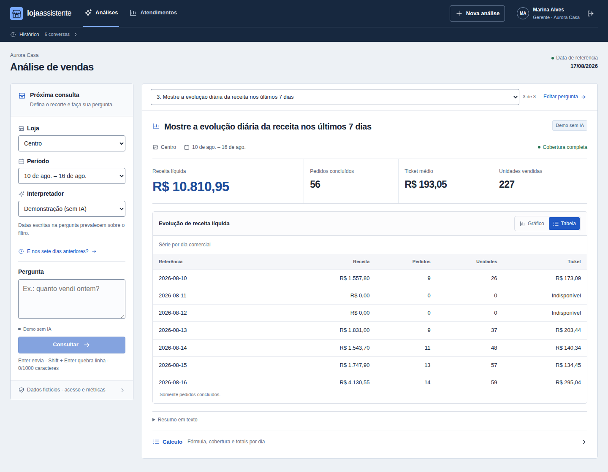

# Conferir a pergunta, o recorte e a conta

Uma soma pode estar correta e ainda responder à pergunta errada. Se a pessoa pedir receita somente em dinheiro, devolver a receita geral esconderia uma limitação dos dados. Esta jornada mostra a consulta válida, a recusa de um filtro não representável e uma nova pergunta válida com o mesmo recorte.

**Resultado histórico de 22/09/2026, anterior à direção visual local atual:** as 68 verificações Playwright passaram, sem skip ou retry: 38 casos puros, 29 jornadas existentes de navegador/HTTP e a nova história abaixo. O [índice da entrega](evidence/operational-proof-20260922/index.json) separa essa execução das provas de backend, das tentativas que falharam e da avaliação paga histórica. Os dados são sintéticos, com **Demo sem IA**; não houve chamada paga nem participante humano.

## 1. Consulta válida com cálculo conferível

*Loja Centro (`a001`), de 10 a 16/08/2026, fuso America/Sao_Paulo, base `synthetic-v1`: R$ 10.810,95, 56 pedidos e 227 unidades. A evidência mostra fórmula, fim exclusivo em 17/08, cobertura 7/7 e linhas diárias.*

A jornada abriu o cálculo pela API e conferiu igualdade com o resultado recebido. A soma das sete linhas coincide com o total apresentado. Essa comparação demonstra consistência da apresentação; não é um oráculo independente da origem. A correção financeira tem testes próprios com a [fixture manual](../backend/tests/manual_fixture.py), cujo exemplo de R$ 30 é outra base e não deve ser confundido com esta tela.

## 2. Recusa que preserva o significado

*“Mostre a receita dos últimos 7 dias somente em dinheiro” recebeu `needs_clarification`, com plano e resultado nulos. A tela informa que não há filtro por pagamento.*

O comportamento evita atribuir uma condição inexistente ao total de vendas. O último plano válido continua disponível para seguimento; uma tentativa recusada não ganha autoridade por estar no histórico.

## 3. Nova tentativa válida, com tabela exata

*Repetir a pergunta válida devolveu as mesmas lojas, período, linhas e totais. A tabela distingue os dias cobertos sem venda, com receita zero e ticket indisponível. As transições finitas foram concluídas pelo coletor Playwright antes da captura, sem edição da imagem. O viewport é 1440×1000.*

São respostas diferentes, com IDs próprios; a igualdade é do conteúdo analítico. A conta gerente usada na automação e o nome exibido são parte da demonstração sintética. Esta recuperação é da interação após uma recusa, não um restore de banco ou um experimento com usuário.

## Dificuldades encontradas e correções

Os testes preservaram falhas antes da aprovação. A preparação inicial tentou gravar cache em diretório sem permissão para o usuário do container; os caches passaram para `/tmp`, sem tornar o serviço root. Um novo teste de rollback esperava uma exceção escapar, mas o middleware já a convertia em HTTP 500 seguro; o teste passou a verificar esse contrato e a reserva persistida.

No navegador, os ensaios revelaram contraste insuficiente em textos do login e ícones de sugestões, campo focado parcialmente fora da tela e uma asserção que ainda procurava a mensagem LLM antiga. Foram corrigidas as cores, a rolagem condicional ao foco e a referência textual do teste. Uma tentativa de rolagem adiada disputou a navegação até o cálculo; a correção final é síncrona e só move o campo quando necessário. As verificações de contraste, foco, obstrução, reflow e sete geometrias foram mantidas.

A rodada final `f98ee94864384422bd835bcabd8f3a11` foi somente de frontend: os 100 arquivos anteriores de backend, avaliação e dados permaneceram idênticos à rodada que aprovou 353 testes. O teste novo do verificador histórico teve 11 casos aprovados separadamente no host. Foram congeladas 158 fontes para esta rodada; elas permaneceram iguais durante a execução. Os ajustes concorrentes de alinhamento, foco e composição IME também foram exercitados; a única mudança posterior à candidata estática foi a política de captura no coletor. O novo [orçamento da aplicação](provider-budget.md) tem evidência própria de concorrência, incerteza e reconciliação; estas capturas em modo Demo não demonstram consumo do provedor.

## O que uma revisão técnica consegue concluir

A entrega permite seguir a capacidade suportada, a autorização do recorte, a conta apresentada, a recusa e a recuperação da interação. As capturas foram feitas na aplicação real, sem substituir conteúdo no DOM. Build, testes e fotografias têm versões e resultados identificados; as falhas anteriores permanecem no índice.

Não houve estudo de produtividade, teste com leitor de tela ou certificação de acessibilidade. O [protocolo de comparação preparado](usage-comparison.md) ainda precisa de participantes. A auditoria adversarial anterior de autenticação/RBAC continua incompleta; estes ensaios não a reclassificam. Os recursos próprios da prova foram encerrados. A última rodada não observou containers externos antes/depois; rodadas anteriores registraram um serviço externo. Outras cargas do computador não foram controladas, e os tempos não são benchmark de capacidade.
