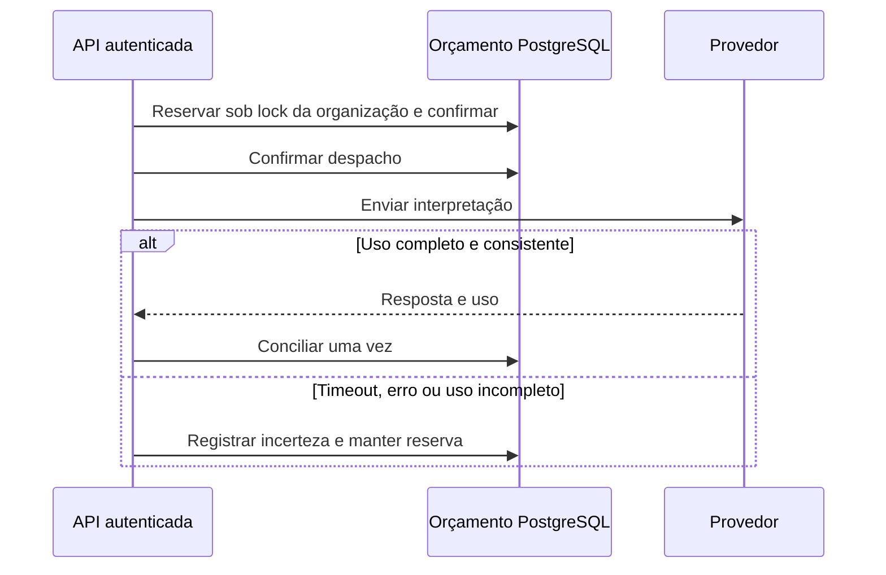

# Limitar chamadas sem esquecer o consumo incerto

Uma requisição pode chegar ao provedor e perder a resposta por timeout. Reiniciar a API ou desfazer a transação da conversa não deve devolver automaticamente esse saldo. O controle da aplicação agora registra uma reserva por organização antes do despacho e mantém a reserva quando não consegue determinar o uso.

O objetivo é limitar a admissão de chamadas pelo caminho LLM da API. **Não é uma fatura, um teto monetário do Azure/OpenAI nem uma garantia de tokenização exata.** A reserva usa bytes UTF-8 de prompt/contexto/schema mais margem de 8.192 unidades; a saída reserva 1.000 unidades, conforme o limite solicitado ao adaptador. Uso real informado pelo provedor substitui essa estimativa quando está completo e consistente. Se exceder a reserva, o excesso é registrado e novas admissões são bloqueadas; isso não desfaz uma cobrança já ocorrida.

## Por que persistir fora da conversa

A [conta de orçamento](../backend/src/loja_assistente/assistant/budget.py) usa transações PostgreSQL curtas e um bloqueio de linha por organização. Reserva e marca de despacho são confirmadas antes da chamada ao SDK. A transação HTTP pode falhar depois, preservando esse registro. O bloqueio da conta não fica aberto durante a comunicação com o provedor.



As reservas guardam organização, usuário, request e call ID. O caminho do adaptador exige que essas identidades correspondam antes de alterar uma reserva. A operação administrativa local tem uma finalidade diferente: registrar evidência de uso obtida pelo operador, com identificação do provedor e referência verificável. Ela não possui endpoint HTTP.

## Estados e consequências

| Estado | O que significa | Efeito sobre o saldo |
| --- | --- | --- |
| `reserved` | Reserva confirmada, sem marca de despacho | Pode ser cancelada pelo caminho que comprovadamente não despachou |
| `dispatched` | Marca durável anterior à chamada ao SDK; não comprova recepção pelo provedor | Continua comprometida mesmo que o processo termine antes de receber resposta |
| `unknown` | Não há uso completo e consistente | Mantém a reserva; não expira nem vira custo zero |
| `reconciled` | Uso completo registrado | Troca a estimativa pelo uso observado; repetição idêntica não altera o saldo novamente |
| `canceled` | Cancelamento anterior ao despacho | Devolve a reserva uma única vez |

Contagem de chamadas permanece comprometida após o despacho. Reconciliação conflitante é recusada. Uso parcial acima da reserva também bloqueia novas chamadas. O bloqueio por excesso não é limpo por aumento de teto. Não há renovação diária, reset automático ou conciliação automática com uma API de faturamento.

Uma interrupção entre reserva e despacho pode conservar saldo em `reserved`. O método de cancelamento exige ausência de despacho; o CLI atual não expõe esse cancelamento. Esse caso requer revisão operacional específica, sem editar contadores ou apagar o ledger para liberar crédito. Na dúvida sobre despacho, manter a reserva é a escolha conservadora.

## Configuração e inspeção

A migração [0003](../backend/migrations/versions/0003_provider_budget.py) acrescenta conta e reservas sem conceder saldo por padrão. O modo Demo continua sem chamar o provedor. Para LLM, chave e ativação da integração precisam ser acompanhadas de uma conta de orçamento para a organização. Sem conta ou sem saldo, o despacho é recusado.

Com o backend e o banco intencionalmente configurados, o [CLI local](../backend/src/loja_assistente/budget_admin.py) oferece:

```powershell
docker compose exec backend python -m loja_assistente.budget_admin --tenant "ID-DA-ORGANIZACAO" status
docker compose exec backend python -m loja_assistente.budget_admin --tenant "ID-DA-ORGANIZACAO" configure --calls 10 --input-units 200000 --output-units 10000 --reason "Limites aprovados para esta operação"
```

Os números são **exemplo de configuração**, não indicação de gasto recomendado nem autorização para executar chamadas. São tetos acumulados absolutos, não crédito adicional; não podem ficar abaixo do já comprometido. O comando `status` permite consultar limites, reservas e observações sem retornar perguntas, chaves ou respostas brutas do provedor. IDs e referências administrativas ainda são metadados internos: não cole dados pessoais ou credenciais nesses campos.

Para uma chamada desconhecida, `reconcile --help` lista os campos exigidos. Informe os três totais observados, com entrada + saída = total, identificação do provedor e referência à evidência obtida. A conciliação exige ao menos um ID válido, não vazio e com até 200 caracteres; identificadores inválidos não contam como evidência, mesmo que o outro campo permita a conciliação. Sem identificação válida, a operação é recusada antes de modificar saldo/estado. O comando registra essa declaração; **não consulta nem autentica sozinho a evidência externa**. Sem uso confirmado, não estimar zero para liberar a reserva.

O downgrade recusa apagar tabelas quando existem reservas. Rollback de aplicação e retenção desse histórico exigem planejamento próprio; o mecanismo não autoriza destruir o ledger.

Para repetir a prova local completa, use `python scripts/prove_budget_ui.py --output D:/private-evidence/loja-new` na raiz. Requer Python no host, Docker/Compose e a imagem `postgres:17.11-bookworm` disponível; o executor inspeciona e fixa seu ID, sem baixá-la automaticamente. O diretório de saída deve ficar fora do repo. O runner usa dados e credenciais sintéticos, provedor simulado, rede interna e recursos próprios. Por padrão recusa workloads ativos; a rodada registrada usou a opção explícita de concorrência e, por isso, seus tempos não são benchmark. A opção `--frontend-only` precisa de uma prova anterior do backend identificada e não declara que o reexecutou.

## Diferença para a avaliação histórica

O ledger em arquivo do [runner de avaliação](live-evaluation.md) continua controlando autorização, etapas e estimativa de custo daquela execução. Ele não substitui a conta PostgreSQL da aplicação. O runner atualizado prepara contas somente em banco de teste dedicado e associa a configuração à autorização; as duas verificações se aplicam ao caminho LLM. Trocar a autorização não apaga consumo anterior.

O teto de US$ 15 da avaliação de 21/09 não foi transformado em limite global da interface. As 55 chamadas e 48.788 tokens históricos também não medem este novo controle. Os resultados dos testes de concorrência, reinício, rollback e reconciliação pertencem à [verificação desta entrega](verification.md).

## O que foi conferido no PostgreSQL

Na rodada local `30792079e0d948258f4ab91d767529c0`, os 353 testes de backend passaram, incluindo 40 novos casos ligados ao orçamento e seu executor; 12 deles estão no [módulo PostgreSQL/API](../backend/tests/test_budget_postgres.py). O provedor foi simulado com `httpx.MockTransport`, sem chamada paga. A aprovação do backend é separada das falhas de interface daquela mesma rodada.

| Situação verificada | Resultado observado |
| --- | --- |
| Oito sessões concorrem por teto de duas chamadas | Dois despachos ao transporte simulado; seis recusas, com duas reservas conciliadas |
| Duas chamadas terminam em timeout e outro processo consulta o ledger | Duas reservas `unknown` permanecem: 24.262 unidades de entrada e 2.000 de saída; terceiro despacho recusado |
| A gravação da resposta falha depois do despacho | HTTP 500 seguro, sem conversa/resposta persistida; uma reserva desconhecida permanece, com 12.131 unidades de entrada e 1.000 de saída |
| Repetir o uso conhecido da mesma chamada | Contadores permanecem em uma chamada, 100 tokens de entrada e 10 de saída; uso conflitante recusado |

As unidades dos casos incertos são reservas daquela pergunta/schema, não tokens medidos. Os testes também verificam isolamento entre organizações e entre usuário/request, ausência de lock da conta durante a rede, cancelamento anterior ao despacho e bloqueio após excesso observado. Os arquivos de teste e os resultados JUnit definem os critérios; as observações de saldo complementam essa evidência, sem substituir os testes.

## Escolha e limites operacionais

Um contador em memória seria menor, mas esqueceria reservas no reinício e não coordenaria processos. Uma quota apenas no runner deixaria as chamadas da interface fora desse controle. PostgreSQL já é parte do produto e permite persistência e exclusão mútua sem adicionar outro serviço; o custo é uma transação e conexão extra por transição, além da operação de casos incertos.

O mecanismo cobre chamadas que passam pelo serviço autenticado da aplicação. Não controla outros programas que utilizem a mesma credencial, nem despesas de infraestrutura. Prazo de 45 s no proxy e cancelamento no navegador continuam sem provar interrupção ou custo zero no provedor. Testes locais usam provedor simulado e dados sintéticos; integração paga, políticas do recurso e uso comercial precisam de verificações próprias.
